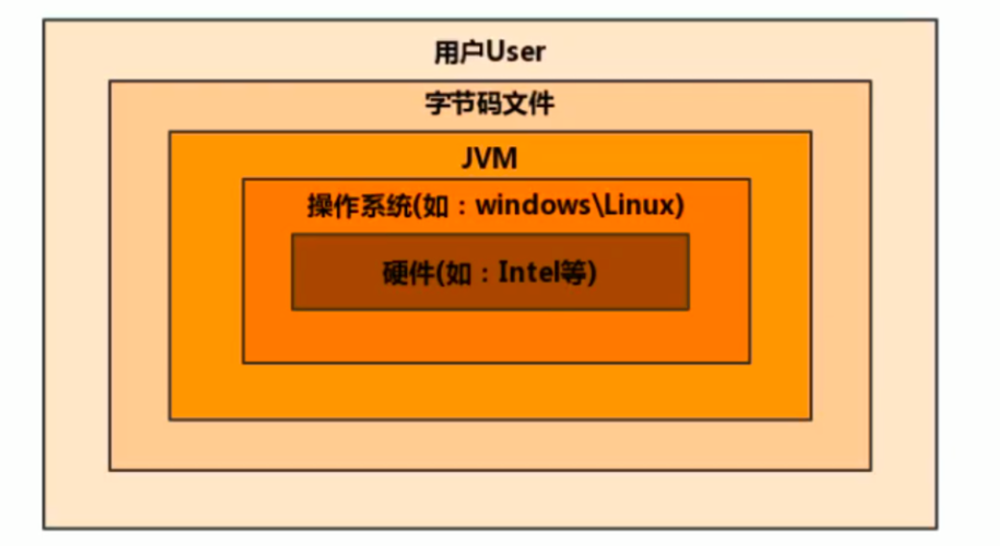
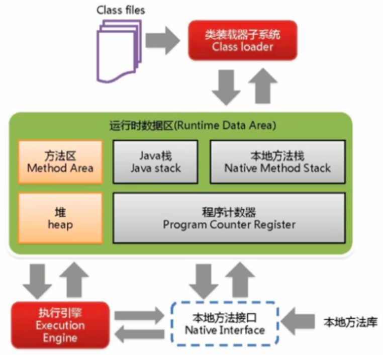

# 初始JVM
只关心==字节码==文件，不关心以什么语言进行编写的
JVM 跨语言的平台

Java 虚拟机与 Java 语言并没有必然的联系，它只与特定的二进制文件格式 Class 文件格式所关联，Class 文件中包含了 Java 虚拟机指令集（或者称为字节码、Bytecodes）和符号表，还有一些其他辅助信息

- 一次遍历，到处运行
- 自动内存管理
- 自动垃圾回收功能



## JVM的整体结构



Java 编译器输入的指令流基本上是一种==基于栈的指令集架构==，另外一种指令集架构则是==基于寄存器的指令集架构==。具体来说：这两种架构之间的区别
- 基于栈式架构的特点：(8位)
    - 设计和实现更简单，适用于资源受限的系统
    - 避开了寄存器的分配难题：使用零地址指令方式分配。
    - 指令流中的指令大部分是零地址指令，其执行过程依赖于操作。指令集更小，编译器容易实现。
    - 不需要硬件支持，可移植性更好，更好实现跨平台
- 基于寄存器架构的特点:(16位)
    - 典型的应用是 x86 的二进制指令集：比如传统的 PC 以及 `Android` 的 `Davlik` 虚拟机。
    - ==指令集架构则完全依赖硬件，可移植性差==
    - 性能优秀和执行更高效
    - 花费更少的指令去完成一项操作。
    - 在大部分情況下，基于寄存器架构的指令集往往都以一地址指令、二地址指令和三地址指令为主，而基于式架构的指令集却是以零地址指令为主。

## JVM的生命周期
- 虚拟机的启动
    - Java虚拟机的启动是通过==引导类加载器==（bootstrap class loader）创建一个初始类（initial class）来完成的，这个类是由虚拟机的具体实现指定的。
- 虚拟机的执行
    - 一个运行中的Java虚拟机有着一个清晰的任务：执行Java程序
    - 程序开始执行时他才运行，程序结束时他就停止
    - 执行一个所谓的Java程序的时候，真真正正在执行的是一个叫做==Java虚拟机的进程==
- 虚拟机的退出
    - 有如下的几种情况：
        - 程序正常执行结束
        - 程序在执行过程中遇到了异常或错误而异常终止
        - 由于操作系统用现错误而导致Java虚拟机进程终止
        - 某线程调用Runtime类或System类的exit()方法，或Runtime类的halt()方法，并且Java安全管理器也允许这次exit()或halt()操作。
            - `Runtime`是JVM在运行时的数据区，使用的设计模式是==单例模式==,使用==饿汉式==
        - 除此之外，JNI（Java Native Interface）规范描述了用JNI Invocation API来加载或卸载 Java虚拟机时，Java虚拟机的退出情况。
          
```java
public class Runtime {
    private static Runtime currentRuntime = new Runtime();

    /**
     * Returns the runtime object associated with the current Java application.
     * Most of the methods of class <code>Runtime</code> are instance
     * methods and must be invoked with respect to the current runtime object.
     *
     * @return  the <code>Runtime</code> object associated with the current
     *          Java application.
     */
    public static Runtime getRuntime() {
        return currentRuntime;
    }

    /** Don't let anyone else instantiate this class */
    private Runtime() {}
}
```


JIT缓存会有一定的启动的延迟，在用户的体验上表现为加载的时间较长，所以不会所有的字节码都使用JIT进行缓存，只会缓存热点的文件
