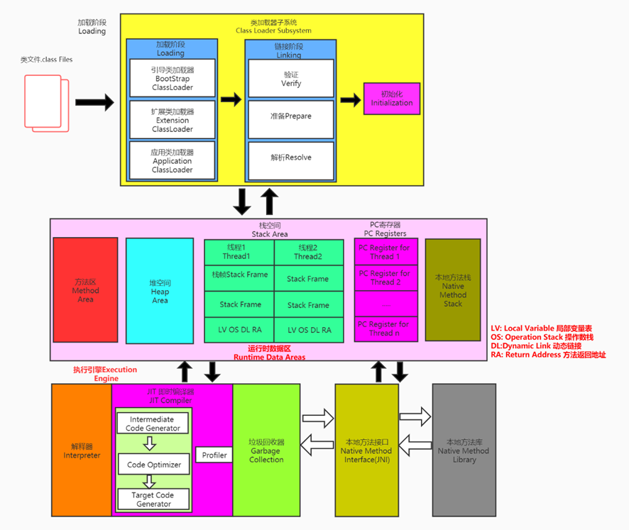
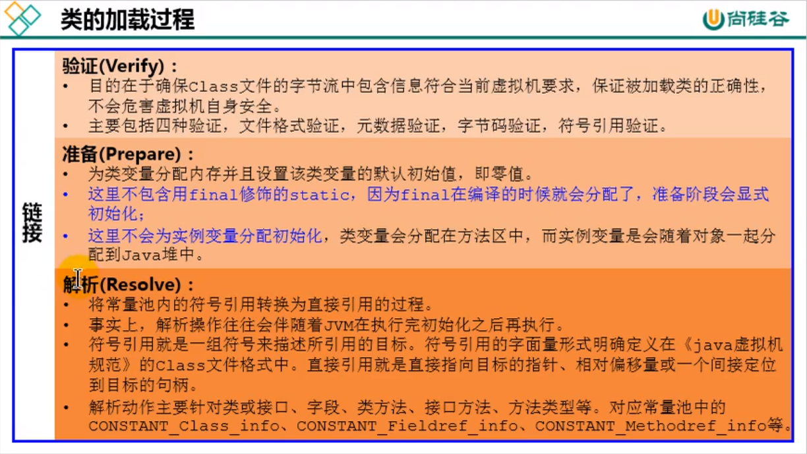
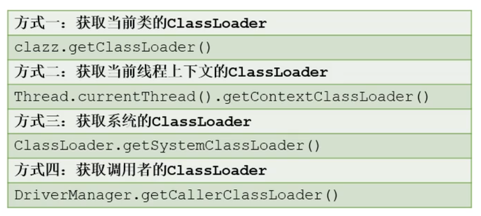

# 类加载子系统

==构建一个JVM，主要是需要类加载器与执行引擎==

- 类加载器子系统负责从文件系统或者网络中加载Class文件，class文件在文件开头有特定的文件标识。(cafe babe)
- ClassLoader==只负责class文件的加载==，至于它是否可以运行，则由Execution Engine决定。
- 加载的类信息存放于一块称为==方法区==的内存空间。除了类的信息外，方法区中还会存放==运行时常量池信息==，可能还包括==字符串字面量和数字常量==（这部分常量信息是Class文件中常量池部分的内存映射）

运行时的常量池
反编译：` javap -v test.class`

```java
Classfile /Users/yangshu/Project/learn_myself/java源码解析/java8_demo/target/classes/out/out/demo/one/test.class
  Last modified 2020-11-4; size 439 bytes
  MD5 checksum 874d3e1dc2e73eee14a744214b28ad87
  Compiled from "test.java"
public class demo.one.test
  minor version: 0
  major version: 52
  flags: ACC_PUBLIC, ACC_SUPER
Constant pool:
   #1 = Methodref          #3.#21         // java/lang/Object."<init>":()V
   #2 = Class              #22            // demo/one/test
   #3 = Class              #23            // java/lang/Object
   #4 = Utf8               <init>
   #5 = Utf8               ()V
   #6 = Utf8               Code
   #7 = Utf8               LineNumberTable
   #8 = Utf8               LocalVariableTable
   #9 = Utf8               this
  #10 = Utf8               Ldemo/one/test;
  #11 = Utf8               main
  #12 = Utf8               ([Ljava/lang/String;)V
  #13 = Utf8               args
  #14 = Utf8               [Ljava/lang/String;
  #15 = Utf8               a
  #16 = Utf8               I
  #17 = Utf8               b
  #18 = Utf8               k
  #19 = Utf8               SourceFile
  #20 = Utf8               test.java
  #21 = NameAndType        #4:#5          // "<init>":()V
  #22 = Utf8               demo/one/test
  #23 = Utf8               java/lang/Object
{
  public demo.one.test();
    descriptor: ()V
    flags: ACC_PUBLIC
    Code:
      stack=1, locals=1, args_size=1
         0: aload_0
         1: invokespecial #1                  // Method java/lang/Object."<init>":()V
         4: return
      LineNumberTable:
        line 7: 0
      LocalVariableTable:
        Start  Length  Slot  Name   Signature
            0       5     0  this   Ldemo/one/test;

  public static void main(java.lang.String[]);
    descriptor: ([Ljava/lang/String;)V
    flags: ACC_PUBLIC, ACC_STATIC
    Code:
      stack=2, locals=4, args_size=1
         0: iconst_1
         1: istore_1
         2: iconst_2
         3: istore_2
         4: iload_1
         5: iload_2
         6: iadd
         7: istore_3
         8: return
      LineNumberTable:
        line 9: 0
        line 10: 2
        line 11: 4
        line 12: 8
      LocalVariableTable:
        Start  Length  Slot  Name   Signature
            0       9     0  args   [Ljava/lang/String;
            2       7     1     a   I
            4       5     2     b   I
            8       1     3     k   I
}
SourceFile: "test.java"
```

## ClassLoader
- class file存在于本地硬盘上，可以理解为设计师画在纸上的模板，而最终这个模板在执行的时候是要加载到JVM当中来根据这个文件实例化出n个一模一样的实例。
- class file加载到JVM中，被称为==DNA元数据模板==，放在==方法区==。
- 在.class文件–>JVM–>最终成为元数据模板，此过程就要一个运输工具（==类装载器Class Loader==），扮演一个快递员的角色。


## 类加载的过程

```java
public class HelloLoader {
    public static void main(String[] args) {
        System.out.println("加载中……");
        
   }
}
```
- 在执行`main`方法之前，首先需要加载`main`方法的承载类`HelloLoader`
- 加载成功后，在进行链接、初始化的操作，完成后调用`HelloLoader`中的main方法
- 加载失败则运行失败，会抛出异常


完整的流程为：
**加载 -> 链接(验证 -> 准备 -> 解析) -> 初始化**

### 加载(loading)
- 通过一个类的**全限定名**获取定义此类的二进制字节流
    - 区分类的两个标志
        - 1. 全限类名是不是相等的
        - 2. 使用的类加载器是不是同一个
- 将这个字节流所代表的静态存储结构转化为方法区的运行时数据结构
- 在内存中生成一个代表这个类的`java.lang.Class`对象，作为方法区这个类的各种数据的访问入口

> 加载class文件的方式

1. 从本地系统中直接加载
2. 通过网络获取，典型场景：Web Applet
3. 从zip压缩包中读取，成为日后jar、war格式的基础
4. 运行时计算生成，使用最多的是：动态代理技术
5. 由其他文件生成，典型场景：JSP应用从专有数据库中提取.class文件，比较少见
6. 从加密文件中获取，典型的防Class文件被反编译的保护措施（==需要用户自定义classLoader类==，进行文件的解密）

### 链接(linking)


#### 验证
- 目的在于确保Class文件的字节流中包含信息符合当前虚拟机要求，保证被加载类的正确性，不会危害虚拟机自身安全
- 主要包括四种验证，文件格式验证，元数据验证，字节码验证，符号引用验证。

字节码文件开头都是`CAFE BABE`

#### 准备
- 为==类变量分配内存==并且设置该类变量的默认初始值，即==零值==（所以在static中，没有声明的对象可以先进行赋值，不会报错）
- 这里不包含用final修饰的static，因为final在编译的时候就会分配好了默认值，准备阶段会显式初始化
- 注意：这里不会为实例变量分配初始化，类变量会分配在方法区中，而实例变量是会随着对象一起分配到Java堆中


```java
public class HelloApp {
    private static int a = 1;   //prepare：a = 0 ---> initial : a = 1

    public static void main(String[] args) {
        System.out.println(a);
    }
}
```

#### 解析
在反编译之后可以查看符号引用

```java
Constant pool:
#1 = Methodref          #3.#21         // java/lang/Object."<init>":()V
#2 = Class              #22            // demo/one/test
#3 = Class              #23            // java/lang/Object
#4 = Utf8               <init>
#5 = Utf8               ()V
#6 = Utf8               Code
#7 = Utf8               LineNumberTable
#8 = Utf8               LocalVariableTable
#9 = Utf8               this
#10 = Utf8               Ldemo/one/test;
#11 = Utf8               main
#12 = Utf8               ([Ljava/lang/String;)V
#13 = Utf8               args
#14 = Utf8               [Ljava/lang/String;
#15 = Utf8               a
#16 = Utf8               I
#17 = Utf8               b
#18 = Utf8               k
#19 = Utf8               SourceFile
#20 = Utf8               test.java
#21 = NameAndType        #4:#5          // "<init>":()V
#22 = Utf8               demo/one/test
#23 = Utf8               java/lang/Object
```

### 初始化
* ==初始化阶段就是执行类构造器方法<clinit>()的过程==
* 此方法不需定义，是`javac`编译器自动收集类中的所有类变量的赋值动作和静态代码块中的语句合并而来。也就是说，==当我们代码中包含static变量的时候，就会有clinit方法==
* `<clinit>()`方法中的指令按语句在源文件==中出现的顺序执行==
* `<clinit>()`不同于类的构造器。（关联：构造器是虚拟机视角下的`<init>()`，类会有默认的构造器）
* 若该类具有父类，JVM会保证子类的<clinit>()执行前，父类的<clinit>()已经执行完毕（==父类的类构造器会在子类之前被执行==）
* 虚拟机必须保证一个类的`<clinit>()`方法在多线程下被同步加锁(==在同一个时间内，只能被不同的线程访问一次==)

==只有在类中包含了static变量时，才会进行`clinit()`==


```java
public class ClassInitTest {
    private static int num = 1;
    private static int number = 10;      //linking之prepare: number = 0 --> initial: 10 --> 20

    static {
        num = 2;
        number = 20;
        System.out.println(num);
        System.out.println(number);
    }

    public static void main(String[] args) {
        System.out.println(ClassInitTest.num);//2
        System.out.println(ClassInitTest.number);//20
    }
}
```


在prepare的时候就会先进行初始化，与static执行的顺序没有关系
```java
public class ClassInitTest {
   private static int num = 1;

   static{
       num = 2;
       number = 20;
       System.out.println(num);
       //System.out.println(number);    //报错：非法的前向引用（可以赋值，但不能调用）
   }

   private static int number = 10;      //linking之prepare: number = 0 --> initial: 20 --> 10

    public static void main(String[] args) {
        System.out.println(ClassInitTest.num);		//2
        System.out.println(ClassInitTest.number);	//10
    }
}
```

虚拟机必须保证一个类的<clinit>()方法在多线程下被同步加锁
```java
public class DeadThreadTest {
    public static void main(String[] args) {
        Runnable r = () -> {
            System.out.println(Thread.currentThread().getName() + "开始");
            DeadThread dead = new DeadThread();
            System.out.println(Thread.currentThread().getName() + "结束");
        };

        Thread t1 = new Thread(r, "线程1");
        Thread t2 = new Thread(r, "线程2");

        t1.start();
        t2.start();
    }
}

class DeadThread {
    static {
        if (true) {
            System.out.println(Thread.currentThread().getName() + "初始化当前类");
            while (true) {

            }
        }
    }
}
```
程序卡死，分析原因：
- 两个线程同时去加载 DeadThread 类，而 DeadThread 类中静态代码块中有一处死循环
- 先加载 DeadThread 类的线程抢到了同步锁，然后在类的静态代码块中执行死循环，而另一个线程在等待同步锁的释放
- 所以无论哪个线程先执行 DeadThread 类的加载，另外一个类也不会继续执行


```java
线程1开始
线程2开始
线程1初始化当前类
```

## 不同的类加载器

类加载器从大类看可以分为两类：
- 引导类加载器（Bootstrap ClassLoader）是`native`方法，底层由C/C++实现
- 自定义加载器（User-Defined ClassLoader）继承于`ClassLoader`接口，使用java进行编写，可以用户进行自定义
    - 将所有**派生于抽象类ClassLoader的类加载器都划分为自定义类加载器**

常见的类加载器一般有三种:


上面类加载器的关系是包含关系，不是上下级的关系，也不是继承的关系，类似于文件夹的形式(例如：a/b/c)
`AppClassLoader` -> `ExtClassLoader` -> `BootStrapClassLoader`

`AppClassLoader`与`ExtClassLoader`两个类加载器都是`sun.misc.Launcher`的内部类

```java
public class ClassLoaderTest {
    public static void main(String[] args) {

        //获取系统类加载器
        ClassLoader systemClassLoader = ClassLoader.getSystemClassLoader();
        System.out.println(systemClassLoader);//sun.misc.Launcher$AppClassLoader@18b4aac2

        //获取其上层：扩展类加载器
        ClassLoader extClassLoader = systemClassLoader.getParent();
        System.out.println(extClassLoader);//sun.misc.Launcher$ExtClassLoader@1540e19d

        //获取其上层：获取不到引导类加载器
        ClassLoader bootstrapClassLoader = extClassLoader.getParent();
        System.out.println(bootstrapClassLoader);//null

        //对于用户自定义类来说：默认使用系统类加载器进行加载
        ClassLoader classLoader = ClassLoaderTest.class.getClassLoader();
        System.out.println(classLoader);//sun.misc.Launcher$AppClassLoader@18b4aac2

        //String类使用引导类加载器进行加载的。---> Java的核心类库都是使用引导类加载器进行加载的。
        ClassLoader classLoader1 = String.class.getClassLoader();
        System.out.println(classLoader1);//null

    }
}
```

- 尝试获取引导类加载器，获取到的值为 null ，这并不代表引导类加载器不存在，因为引导类加载器右 C/C++ 语言，我们获取不到
- 两次获取系统类加载器的值都相同：`sun.misc.Launcher$AppClassLoader@18b4aac2` ，这说明系统类加载器是全局唯一的
- Java的核心类库都是使用引导类加载器进行加载的。(String)

### 启动类加载器（BootStrapClassLoader）
- 这个类加载使用C/C++语言实现的，嵌套在JVM内部
- 它用来加载Java的核心库（`JAVA_HOME/jre/lib/rt.jar、resources.jar`或`sun.boot.class.path`路径下的内容），用于提供JVM自身需要的类
- 并不继承自`java.lang.ClassLoader`，没有父加载器
- 加载扩展类和应用程序类加载器，并作为他们的父类加载器
- 出于安全考虑，Bootstrap启动类加载器只加载包名为`java、javax、sun`等开头的类

### 扩展类加载器（Extension ClassLoader）
- Java语言编写，由`sun.misc.Launcher$ExtClassLoader`实现
- 派生于`ClassLoader`类
- 父类加载器为启动类加载器
- 从`java.ext.dirs`系统属性所指定的目录中加载类库，或从JDK的安装目录的`jre/lib/ext`子目录（扩展目录）下加载类库。如果用户创建的JAR放在此目录下，也会自动由扩展类加载器加载

### 系统类加载器（AppClassLoader）
- Java语言编写，由`sun.misc.LaunchersAppClassLoader`实现
- 派生于`ClassLoader`类
- 父类加载器为扩展类加载器
- 它负责加载环境变量`classpath`或系统属性`java.class.path`指定路径下的类库
- 该类加载是程序中默认的类加载器，一般来说，Java应用的类都是由它来完成加载
- 通过`ClassLoader.getSystemclassLoader()`方法可以获取到该类加载器


```java
public class ClassLoaderTest1 {
    public static void main(String[] args) {

        System.out.println("**********启动类加载器**************");
        //获取BootstrapClassLoader能够加载的api的路径
        URL[] urLs = sun.misc.Launcher.getBootstrapClassPath().getURLs();
        for (URL element : urLs) {
            System.out.println(element.toExternalForm());
        }
        //从上面的路径中随意选择一个类,来看看他的类加载器是什么:引导类加载器
        ClassLoader classLoader = Provider.class.getClassLoader();
        System.out.println(classLoader);//null

        System.out.println("***********扩展类加载器*************");
        String extDirs = System.getProperty("java.ext.dirs");
        for (String path : extDirs.split(";")) {
            System.out.println(path);
        }

        //从上面的路径中随意选择一个类,来看看他的类加载器是什么:扩展类加载器
        ClassLoader classLoader1 = CurveDB.class.getClassLoader();
        System.out.println(classLoader1);//sun.misc.Launcher$ExtClassLoader@1540e19d

    }
}
```

运行结果
```java
**********启动类加载器**************
file:/Library/Java/JavaVirtualMachines/jdk1.8.0_181.jdk/Contents/Home/jre/lib/resources.jar
file:/Library/Java/JavaVirtualMachines/jdk1.8.0_181.jdk/Contents/Home/jre/lib/rt.jar
file:/Library/Java/JavaVirtualMachines/jdk1.8.0_181.jdk/Contents/Home/jre/lib/sunrsasign.jar
file:/Library/Java/JavaVirtualMachines/jdk1.8.0_181.jdk/Contents/Home/jre/lib/jsse.jar
file:/Library/Java/JavaVirtualMachines/jdk1.8.0_181.jdk/Contents/Home/jre/lib/jce.jar
file:/Library/Java/JavaVirtualMachines/jdk1.8.0_181.jdk/Contents/Home/jre/lib/charsets.jar
file:/Library/Java/JavaVirtualMachines/jdk1.8.0_181.jdk/Contents/Home/jre/lib/jfr.jar
file:/Library/Java/JavaVirtualMachines/jdk1.8.0_181.jdk/Contents/Home/jre/classes
null
***********扩展类加载器*************
/Users/yangshu/Library/Java/Extensions:/Library/Java/JavaVirtualMachines/jdk1.8.0_181.jdk/Contents/Home/jre/lib/ext:/Library/Java/Extensions:/Network/Library/Java/Extensions:/System/Library/Java/Extensions:/usr/lib/java
sun.misc.Launcher$ExtClassLoader@3b9a45b3
```

## 用户自定义类加载器
### 为什么要去定义
在Java的日常应用程序开发中，类的加载几乎是由上述3种类加载器相互配合执行的，在必要时，我们还可以自定义类加载器，来定制类的加载方式。那为什么还需要自定义类加载器？
- 隔离加载类
- 修改类加载的方式
- 扩展加载源
- 防止源码泄漏

### 如何自定义
- 可以通过继承抽象类`java.lang.ClassLoader`类的方式，实现自己的类加载器，以满足一些特殊的需求
- 在JDK1.2之前，在自定义类加载器时，总会去继承ClassLoader类并重写`loadClass()`方法，从而实现自定义的类加载类，但是在JDK1.2之后已不再建议用户去覆盖`loadClass()`方法，而是建议把自定义的类加载逻辑写在`findclass()`方法中
- 在编写自定义类加载器时，如果没有太过于复杂的需求，可以直接继承`URIClassLoader`类，这样就可以避免自己去编写`findclass()`方法及其获取字节码流的方式，使自定义类加载器编写更加简洁。


```java
public class CustomClassLoader extends ClassLoader {
    @Override
    protected Class<?> findClass(String name) throws ClassNotFoundException {

        try {
            byte[] result = getClassFromCustomPath(name);
            if (result == null) {
                throw new FileNotFoundException();
            } else {
                return defineClass(name, result, 0, result.length);
            }
        } catch (FileNotFoundException e) {
            e.printStackTrace();
        }

        throw new ClassNotFoundException(name);
    }

    private byte[] getClassFromCustomPath(String name) {
        //从自定义路径中加载指定类:细节略
        //如果指定路径的字节码文件进行了加密，则需要在此方法中进行解密操作。
        return null;
    }

    public static void main(String[] args) {
        CustomClassLoader customClassLoader = new CustomClassLoader();
        try {
            Class<?> clazz = Class.forName("One", true, customClassLoader);
            Object obj = clazz.newInstance();
            System.out.println(obj.getClass().getClassLoader());
        } catch (Exception e) {
            e.printStackTrace();
        }
    }
}
```

`sun.misc.Launcher`它是一个java虚拟机的入口应用


### 获取ClassLoader途径


```java
public class ClassLoaderTest2 {
    public static void main(String[] args) {
        try {
            
            //1. Class.forName().getClassLoader()
            ClassLoader classLoader = Class.forName("java.lang.String").getClassLoader();
            System.out.println(classLoader); // String 类由启动类加载器加载，我们无法获取

            //2. Thread.currentThread().getContextClassLoader()
            ClassLoader classLoader1 = Thread.currentThread().getContextClassLoader();
            System.out.println(classLoader1);

            //3. ClassLoader.getSystemClassLoader().getParent()
            ClassLoader classLoader2 = ClassLoader.getSystemClassLoader();
            System.out.println(classLoader2);

        } catch (ClassNotFoundException e) {
            e.printStackTrace();
        }
    }
}

// 输出
null
sun.misc.Launcher$AppClassLoader@18b4aac2
sun.misc.Launcher$AppClassLoader@18b4aac2
```

## 双亲委派机制

### 原理
Java虚拟机对class文件采用的是**按需加载**的方式，也就是说==当需要使用该类时才会将它的class文件加载到内存生成class对象==。而且加载某个类的class文件时，Java虚拟机采用的是==双亲委派模式，即把请求交由父类处理，它是一种任务委派模式==

- 如果一个类加载器收到了类加载请求，它并不会自己先去加载，而是把**这个请求委托给父类的加载器**去执行；
- 如果父类加载器还存在其父类加载器，则进一步向上委托，依次递归，请求最终将==到达顶层的启动类加载器==；
- 如果父类加载器可以完成类加载任务，就成功返回，倘若父类加载器无法完成此加载任务，==子加载器才会尝试自己去加载，这就是双亲委派模式==。
- 父类加载器一层一层往下分配任务，如果子类加载器能加载，则加载此类，如果将加载任务分配至系统类加载器也无法加载此类，则抛出异常


### 举例
#### 1
建立一个` java.lang.String` 类，写上 `static` 代码块

```java
package java.lang;

public class String {
    static{
        System.out.println("我是自定义的String类的静态代码块");
    }
}
```

另外的程序中加载 String 类

```java
public class StringTest {

    public static void main(String[] args) {
        java.lang.String str = new java.lang.String();
        System.out.println("hello,atguigu.com");

        StringTest test = new StringTest();
        System.out.println(test.getClass().getClassLoader());
    }
}
```
==程序并没有输出我们静态代码块中的内容，可见仍然加载的是 JDK 自带的 String 类==,找到了最上层的启动类加载器`BootStrapClassLoader`，加载自带的`String`类

#### 2
自定义的`String`中添加`mian`方法

```java
package java.lang;

public class String {
    static{
        System.out.println("我是自定义的String类的静态代码块");
    }
    //错误: 在类 java.lang.String 中找不到 main 方法
    public static void main(String[] args) {
        System.out.println("hello,String");
    }
}
```

由于双亲委派机制找到的是 JDK 自带的 String 类，在那个 String 类中并没有 main() 方法，会抛出异常

```txt
错误: 在类 java.lang.String 中找不到 main 方法, 请将 main 方法定义为:
   public static void main(String[] args)
否则 JavaFX 应用程序类必须扩展javafx.application.Application
```

#### 3
在 `java.lang` 包下自定义类

```java
package java.lang;

public class ShkStart {
    public static void main(String[] args) {
        System.out.println("hello!");
    }
}
```
出于==保护机制==，java.lang 包下**不允许我们自定义类**


```txt
Error: A JNI error has occurred, please check your installation and try again
Exception in thread "main" java.lang.SecurityException: Prohibited package name: java.lang
	at java.lang.ClassLoader.preDefineClass(ClassLoader.java:662)
	at java.lang.ClassLoader.defineClass(ClassLoader.java:761)
	at java.security.SecureClassLoader.defineClass(SecureClassLoader.java:142)
	at java.net.URLClassLoader.defineClass(URLClassLoader.java:467)
	at java.net.URLClassLoader.access$100(URLClassLoader.java:73)
	at java.net.URLClassLoader$1.run(URLClassLoader.java:368)
	at java.net.URLClassLoader$1.run(URLClassLoader.java:362)
	at java.security.AccessController.doPrivileged(Native Method)
	at java.net.URLClassLoader.findClass(URLClassLoader.java:361)
	at java.lang.ClassLoader.loadClass(ClassLoader.java:424)
	at sun.misc.Launcher$AppClassLoader.loadClass(Launcher.java:349)
	at java.lang.ClassLoader.loadClass(ClassLoader.java:357)
	at sun.launcher.LauncherHelper.checkAndLoadMain(LauncherHelper.java:495)

```

#### 4
当加载jdbc.jar 用于实现数据库连接的时候
- jdbc.jar是基于SPI接口进行实现的
- 所以在加载的时候，会进行双亲委派，最终从根加载器中加载 SPI核心类，然后再加载SPI接口类
- 接着在进行反向委托，通过线程上下文类加载器进行实现类 jdbc.jar的加载。

### 双亲委派机制的优势
- 避免类的重复加载
- 保护程序安全，防止核心API被随意篡改
    - 自定义类：`java.lang.String` 不会进行加载
    - 自定义类：`java.lang.ShkStart`（报错：阻止创建 `java.lang`开头的类）

## 沙箱安全机制
- 自定义String类时：在加载自定义String类的时候会率先使用引导类加载器加载，而引导类加载器在加载的过程中会先加载jdk自带的文件（rt.jar包中java.lang.String.class），报错信息说没有main方法，就是因为加载的是rt.jar包中的String类。
- 这样可以保证对java核心源代码的保护，这就是沙箱安全机制。

## 如何判断两个class对象是否相同？
在JVM中表示两个class对象是否为同一个类存在两个必要条件：
- 类的完整类名必须一致，包括包名（全限类名相等）
- 加载这个类的ClassLoader（指ClassLoader实例对象）必须相同
    - 换句话说，在JVM中，即使这两个类对象（class对象）来源同一个Class文件，被同一个虚拟机所加载，但只要加载它们的ClassLoader实例对象不同，那么这两个类对象也是不相等的


## 对类加载器的引用（引用信息保存在方法区中）
- JVM必须知道一个类型是由启动加载器加载的还是由用户类加载器加载的
- 如果一个类型是由用户类加载器加载的，那么JVM会将这个类加载器的一个引用作为类型信息的一部分保存在方法区中
- 当解析一个类型到另一个类型的引用的时候，JVM需要保证这两个类型的类加载器是相同的
    
## 类的主动使用和被动使用
Java程序对类的使用方式分为：主动使用和被动使用。主动使用，又分为七种情况：

1. 创建类的实例
2. 访问某个类或接口的静态变量，或者对该静态变量赋值
3. 调用类的静态方法
4. 反射（比如：Class.forName(“java.lang.String”)）
5. 初始化一个类的子类
6. Java虚拟机启动时被标明为启动类的类
7. JDK7开始提供的动态语言支持：java.lang.invoke.MethodHandle实例的解析结果REF_getStatic、REF putStatic、REF_invokeStatic句柄对应的类没有初始化，则初始化

除了以上七种情况，其他使用Java类的方式都被看作是对类的被动使用，都不会导致类的初始化，即不会执行初始化阶段（不会调用 clinit() 方法和 init() 方法）