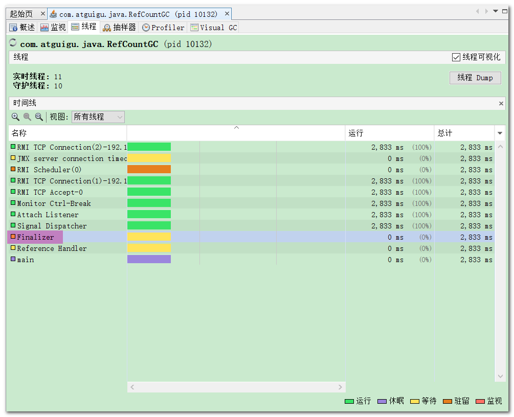

# 垃圾回收的相关算法
主要针对的是 堆
# 判断用户存活的方式
垃圾标记阶段：对象存活的判断
- 只有标记是死亡的对象，才会对其进行GC操作
- 不被任何存活的对象继续的引用，就可以判断该对象已死亡
- 判断对象存活的方式：**引用计数算法** 与 **可达性分析算法**

## 引用计数算法
每个对象保存一个整型的引用计数的属性，用户记录对象被引用的情况。
- 对于对象A，有一个引用，计数器就会 +1，引用失效，计数器就会 -1。当引用计数器的值为0的时候，表明对象不会被使用，可以被回收

优点：
- 实现简单，垃圾对象便于辨识
- 判定效率高，回收没有延迟性

缺点：
- 需要单独的字段储存，增加了开销
- 每一次都需要更新计数器，需要进行加法与减法，增加了时间的开销
- **有一个严重的问题，==无法去处理循环引用==的情况**，在java的垃圾回收器中没有使用这类的算法。

- p断掉了，后面的循环引用并没有断，引用计数器并不为0，会有**内存泄露的风险** （==在java中不会出现类似的内存泄露的例子，因为在java中没有使用引用计数器作为判断对象存活的方式==）

在java中使用显示的GC `System.gc()` ，会回收掉**循环引用**，==也表明了在java中没有使用引用计数器==

-------
在python中使用了引用计数算法。`看中了优点，实现简单，效率高，垃圾回收没有延迟`

python中如何解决循环引用的问题：
- 手动解除：在合适的时机，手动的解除循环引用（在编写代码的角度）
- 使用弱引用weakref，是python的标准库，用户解决循环引用的问题（==发生GC，只要是弱引用，都会进行回收==）

## 可达性分析算法（根搜索算法、追踪性垃圾搜集）
同样有实现简单，执行高效的特性，同时可以有效的去解决**在引用计数算法中的循环引用的问题，防止了内存泄露**

- 是java，c++的选择，通常称为==追踪性垃圾收集==

-------
`GC Roots`根集合是一组必须活跃的引用
- 以GC Roots为起始点，从上到下的进行搜索，判断==搜索根对象集合与所连接的目标对象是否可达==（根节点到叶子节点）
- 使用可达性分析算法后，内存中存活的对象都会被GC Roots直接或者间接的连接，搜索走过的路径称为**引用链**
- 不可达表示对象已经死亡，可以被回收


### GC Roots
- 虚拟机栈中的引用对象
    - 各线程中被调用方法中使用到的参数，局部变量
- 本地方法栈（JNI）引用的对象（native）
- 方法区中的类静态属性引用的对象
- 方法区中的常量池中对象
    - 字符串常量池
- 被同步锁`synchronized`持有的对象
- JVM内部的引用
    - 常用的异常，nullPointerException


==分代搜集与局部回收==
- 可能会有其他的对象临时的进行加入，比如：分代搜集与局部回收。
- 如果只针对Java堆中的某一块区域进行垃圾回收（比如：典型的只针对新生代），必须考虑到内存区域是虚拟机自己的实现细节，更不是孤立封闭的，这个区域的对象完全有可能被其他区域的对象所引用，这时候就需要一并将关联的区域对象也加入GC Roots集合中去考虑，才能保证可达性分析的准确性。（==新生代，老年代之类的==）

==GC进行时必须“Stop The World”的一个重要原因。即使是号称（几乎）不会发生停顿的CMS收集器中，枚举根节点时也是必须要停顿的。==

# 对象的 finalization 机制（在对象回收前先去自动的调用finalize()，例如保存资源，释放资源）
- 当垃圾回收器发现没有引用指向一个对象，即：垃圾回收此对象之前，==总会先调用这个对象的finalize()方法。==
- ==在Object类中可以找到==
- 可以被重写，在对象回收前进行资源的释放

==永远不要手动的去调用finalize()==

由于finalize的存在，==JVM中的对象有三种可能的状态==：（如果从所有的根节点都无法访问到某个对象，说明对象己经不再使用了。一般来说，此对象需要被回收。但事实上，也并非是“非死不可”的，这时候它们暂时处==于“缓刑”阶段==。==一个无法触及的对象有可能在某一个条件下“复活”自己==，如果这样，那么对它立即进行回收就是不合理的）
- 可触及对象：从根节点可以到达该对象
- 可复活对象：对象所有的引用都被释放，但是可能被finalize()方法复活
- 不可触及对象（不可能在复活）：对象的finalize()被调用，并且没有复活，那么就会进入不可触及状态。不可触及的对象不可能被复活，因为finalize()只会被调用一次。

-------


    判定一个对象objA是否可回收，至少要**经历两次标记过程**：
    
    1. 如果对象objA到GC Roots没有引用链，则进行第一次标记。
    2. 进行筛选，判断此对象是否有必要执行finalize()方法
        1. 如果对象objA**没有重写**finalize()方法，或者finalize()方法已经被虚拟机调用过，则虚拟机视为“没有必要执行”，objA被判定为不可触及的。
        2. 如果对象objA重写了finalize()方法，且还未执行过，那么objA会被插入到F-Queue队列中，由一个虚拟机自动创建的、低优先级的Finalizer线程触发其finalize()方法执行。
        3. finalize()方法是对象逃脱死亡的最后机会，稍后GC会对F-Queue队列中的对象进行第二次标记。**如果objA在finalize()方法中与引用链上的任何一个对象建立了联系，那么在第二次标记时，objA会被移出“即将回收”集合**。
    之后，对象会再次出现没有引用存在的情况。在这个情况下，finalize()方法不会被再次调用，对象会直接变成不可触及的状态，也就是说，**一个对象的finalize()方法只会被调用一次。**


- 该线程优先级很低，有一定的执行等待的时间
- 在模拟的时候使用`sleep()`
- finalize()方法只有被调用一次


```java
public class CanReliveObj {
    public static CanReliveObj obj;//类变量，属于 GC Root


    //此方法只能被调用一次
    @Override
    protected void finalize() throws Throwable {
        super.finalize();
        System.out.println("调用当前类重写的finalize()方法");
        obj = this;//当前待回收的对象在finalize()方法中与引用链上的一个对象obj建立了联系
    }


    public static void main(String[] args) {
        try {
            obj = new CanReliveObj();
            // 对象第一次成功拯救自己
            obj = null;
            System.gc();//调用垃圾回收器
            System.out.println("第1次 gc");
            // 因为Finalizer线程优先级很低，暂停2秒，以等待它
            Thread.sleep(2000);
            if (obj == null) {
                System.out.println("obj is dead");
            } else {
                System.out.println("obj is still alive");
            }
            System.out.println("第2次 gc");
            // 下面这段代码与上面的完全相同，但是这次自救却失败了
            obj = null;
            System.gc();
            // 因为Finalizer线程优先级很低，暂停2秒，以等待它
            Thread.sleep(2000);
            if (obj == null) {
                System.out.println("obj is dead");
            } else {
                System.out.println("obj is still alive");
            }
        } catch (InterruptedException e) {
            e.printStackTrace();
        }
    }
}
```

```shell
调用当前类重写的finalize()方法
第1次 gc
obj is still alive
第2次 gc
obj is dead
```

# GC Roots 溯源
## MAT 介绍
MAT是Memory Analyzer的简称，它是一款功能强大的**==Java堆内存分析器==**。用于查找内存泄漏以及查看内存消耗情况。

## java中会出现的内存泄露的定义


- 如上图所示，object4咩有实际的使用，但是还是和GC Roots有间接的联系 -- ==需要使用GC Roots溯源的方法进行查找，出现OOM是可以进行的操作==
- 可以使用==JProfiler==

# 垃圾清理算法
标记存活，死亡对象后，需要对垃圾进行清理
- 标记-清除算法（Mark-Sweep）
- 复制算法（Copying）
- 标记-压缩算法（Mark-Compact）

## 标记-清除（mark -Sweep）算法
当堆中的有效内存空间（available memory）被耗尽的时候，就会停止整个程序（也被称为stop the world），然后进行两项工作，**第一项则是标记，第二项则是清除**
- 标记（==没有遍历所有的对象==）：Collector(**收集器**)从引用根节点开始遍历，**标记所有被引用的对象**
    - ==标记的是可达的对象，是非垃圾的对象==
    - 一般是在对象的Header（对象头中，对象头中包括运行时元数据，类型指针，对象中包括:对象头，实例数据，对齐填充）中记录为可达对象。
- 清除（==遍历堆中的所有的对象==）：Collector对堆内存从头到尾进行线性的遍历，如果发现某个对象在其Header中没有标记为可达对象，则将其回收


### 优点
基础的算法，比较好实现

### 缺点
- 效率不算高（需要进行遍历，在标记阶段需要进行递归的遍历(树)，清除的时候需要遍历全堆）
- 进行GC时，需要停止所有的应用程序，影响用户体验
- 标记-清除算法，**==清理的内存是不连续的，产生了内存碎片，需要使用一个空闲的列表去记录空闲的区域==**

-------
关于空闲列表是在为对象分配内存的时候提过：
- 如果内存规整
    - 采用指针碰撞的方式进行内存分配
- 如果内存不规整
    - 虚拟机需要维护一个空闲列表
    - 采用空闲列表分配内存

==内存不规整的时候，大对象就可能分配不了，导致OOM==


### 清除对象的方式（并没有真正的清除）
这里所谓的清除并不是真的置空，==而是把需要清除的对象地址保存在空闲的地址列表里==。下次有新对象需要加载时，判断垃圾的位置空间是否够，如果够，就存放覆盖原有的地址。


## 复制算法（为了解决标记-清除算法在效率上的缺陷）
**将内容空间分为两块**，每次只会使用其中的一块，垃圾回收的时候，将使用的一块内容中存活的对象复杂到为使用的一块内存中，然后在交换两块内存的角色，最后完成垃圾回收


- 内存是连续的，复制的时候的操作
- 也是标记的可达的对象，不可达的对象不好进行标记

### 优点
- 没有标记与清除的过程（直接使用Roots进行遍历，将遍历到的对象，即存活的对象复制到另一个区域），效率高
- 保证了空间的连续性，不会出现内碎片的问题
    - **可以使用指针碰撞去分配对象的内存**

### 缺点
- 需要使用两倍的内存空间
- **对于G1这种分拆成为大量region的GC，复制而不是移动，意味着GC需要维护region之间对象引用关系，不管是内存占用或者时间开销也不小**
    - **复制的时候，对象引用的地址需要频繁的改变**

### 应用的场景（存活的对象少，垃圾多的场景）
- **==一般使用在新生代中对象的垃圾回收==**
- ==**不会使用在老年代中**==，每次都需要复制大量的算法，导致复制算法的性能急剧的下降

## 标记-压缩(整理)算法
标记-清除算法的确可以应用在老年代中，但是该算法不仅执行效率低下，而且在执行完内存回收后还会产生**==内存碎片==**

- 标记：标记可达的对象
- 清除：将存活对象压缩到内存的一端，按顺序排放
    - 清理边界外所有的空间
    - 可以使用指针碰撞


- ==标记-压缩算法的最终效果等同于标记-清除算法执行完成后，再进行一次内存碎片整理==
- 标记的存活对象将会被整理，按照内存地址依次排列，而未被标记的内存会被清理掉。如此一来，当我们需要给新对象分配内存时，JVM只需要持有一个内存的起始地址即可，这比维护一个空闲列表显然少了许多开销。

### 优点
- 相比于标记-清除算法，解决了内存碎片的问题
- 相比于复制算法，不用使用双倍的内存

### 缺点
- 效率要低于复制算法（涉及到清理边界的问题）
- 移动对象的时候，需要改变对象的引用地址
- STW

## 三种算法的比较


没有最好的算法，只有最合适的算法

# 分代搜集算法

不同生命周期的对象可以采取不同的收集方式，以便提高回收效率。

在HotSpot中，基于分代的概念，GC所使用的内存回收算法必须结合年轻代和老年代各自的特点
- 年轻代（复制算法）
    - 年轻代特点：区域相对老年代较小，对象生命周期短、存活率低，回收频繁。
    - ==**复制算法**==的回收整理，速度是最快的。复制算法的效率只和当前存活对象大小有关，因此很适用于年轻代的回收。而复制算法内存利用率不高的问题，通过hotspot中的两个survivor的设计得到缓解。
- 老年代
    - 老年代特点：区域较大，对象生命周期长、存活率高，回收不及年轻代频繁。
    - 这种情况存在大量存活率高的对象，复制算法明显变得不合适。一般是由标记-清除或者是标记-清除与标记-整理的混合实现。
        - Mark阶段的开销与存活对象的数量成正比。
        - Sweep阶段的开销与所管理区域的大小成正相关。
        - Compact阶段的开销与存活对象的数据成正比。
        

-------
> 以HotSpot中的**CMS回收器**为例，CMS是基于**Mark-Sweep**实现的，对于对象的回收效率很高。
> 
>  对于==碎片问题，CMS采用基于Mark-Compact==算法的Serial Old回收器作为补偿措施：当内存回收不佳（碎片导致的Concurrent Mode Failure时），将采用Serial Old执行Full GC以达到对老年代内存的整理。
> 
==分代的思想被现有的虚拟机广泛使用==。几乎所有的垃圾回收器都区分新生代和老年代

# 增量收集算法和分区算法
## 增量收集算法（交替的执行垃圾回收的线程与用户线程，而不是STW）
STW影响用户体验，**增量搜集算法**实时的垃圾回收

- 如果一次性将所有的垃圾进行处理，需要造成系统长时间的停顿，那么就==可以让垃圾收集线程和应用程序线程交替执行==。每次，垃圾收集线程只收集一小片区域的内存空间，接着切换到应用程序线程。依次反复，直到垃圾收集完成。
- 总的来说，增量收集算法的基础仍是传统的标记-清除和复制算法。增量收集算法通过对线程间冲突的妥善处理，允许垃圾收集线程以分阶段的方式完成标记、清理或复制工作

### 缺点
- 因为线程切换和上下文转换的消耗，会增加垃圾回收的总的成本，造成系统吞吐量的降低（比如:需要一些切换机制）

## 分区算法（降低延迟）

- 在相同条件下，堆空间越大，一次GC时所需要的时间就越长，有关GC产生的停顿也越长。
- 为了更好地控制GC产生的停顿时间，==将一块大的内存区域分割成多个小块==，根据目标的停顿时间，每次==合理地回收若干个小区间，而不是整个堆空间==，从而减少一次GC所产生的停顿。

-------
分代算法将按照对象的生命周期长短划分成两个部分；
分区算法将整个堆空间划分成连续的不同小区间。

每一个小区间都独立使用，独立回收。这种算法的好处是可以控制一次回收多少个小区间。


