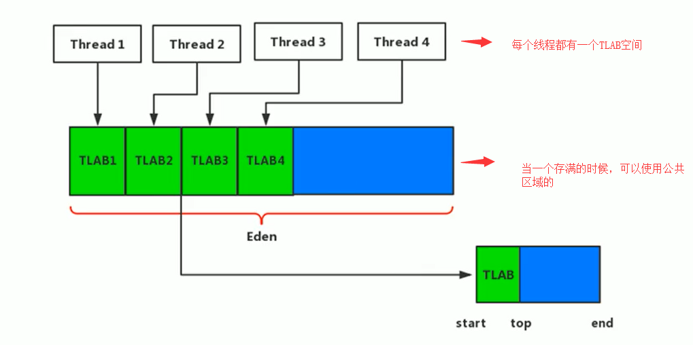

# 堆
- 堆内存是用来存放由==new创建的对象和数组==，即动态申请的内存都存放在堆内存（**_*new出来的对象不一定在堆中*_**，逃逸分析与标量替换后，int x = 1;int y = 9;可能分配在栈上）
- 栈内存是用来存放在函数中定义的一些基本类型的变量和对象的引用变量

局部变量存放在栈；new函数和malloc函数申请的内存在堆；函数调用参数，函数返回值，函数返回地址存放在栈
[new创建对象，对象保存在堆还是栈?](https://blog.csdn.net/kl1411/article/details/65959992)

[new分配的内存一定在堆上么?](https://blog.csdn.net/wretchedme/article/details/45369711?utm_medium=distribute.pc_relevant.none-task-blog-BlogCommendFromBaidu-2.control&depth_1-utm_source=distribute.pc_relevant.none-task-blog-BlogCommendFromBaidu-2.control)

# 基础概念
堆在一个JVM中是进程共享的，**一个JVM进程只有一个堆**


- 在JVM启动的时候就被创建，空间大小也被确认，大小是可以在JVM启动的时候进行调节的
    - 启动一个`main`方法就会开启一个JVM进程
- **堆可以处在物理不连续的空间中，但是在逻辑上是连续的**
- 在堆上，也可以划分线程私有的缓冲区TLAB（Thread Local Allocation Buffer）
- 所有的对象**几乎**都是在堆上进行储存，但是不是所有的，在JDK7以后，可以通过逃逸分析，将部分的对象分配在栈上
- 数组和对象可能永远都不会保留在栈上，在栈帧中只有保存对象的引用，引用在指向对象或者数组在堆中分配的位置
- 在方法结束后，**堆中的对象不会被马上的移除**，仅仅在**垃圾回收**的时候才会被移除
    - 触发了GC了，才会移除无用的对象
    - 在进行GC时，会终止用户所有的线程（STW stop the world）
- 堆是GC的重点区域


-------
设置堆内存的大小：
- `-Xms20m -Xmx20m` 
    - `-Xms`表示的是分配的最小的堆内存：物理电脑内存大小的`1/64`
    - `-XMx`表示的是分配的最大的堆内存: 物理电脑内存大小的 `1/4`
    - **一般将两者的大小设置成一样的**：为了能够在Java垃圾回收机制清理完堆区后不需要重新分隔计算堆区的大小，从而提高性能。

-------

    java中自带的堆可视化工具：`jvisualvm`

# 堆内存分区
在java7及之前，分为：新生区、养老区、永久区
- `Young/New Generation Space` 新生区，又被划分为`Eden`区和`Survivor`区
- `Old/Tenure generation space` 养老区
- `Permanent Space`永久区 

在java8及以后，分为：新生区、养老区、元空间
- `Young/New Generation Space` 新生区，又被划分为`Eden`区和`Survivor`区
- `Old/Tenure generation space` 养老区
- `Meta Space` 元空间

默认 `Eden` : `Survivor0` : `Survivor2` = `8 : 1 : 1`
默认 `Tenure generation space` : `New Generation Space` = `2 : 1`


## 在命令行中查看堆内存的两种方式
- 方式一：命令行依次执行如下两个指令
    - `jps`
    - `jstat -gc 进程id`
- 方式二：设置虚拟机参数 `-XX:+PrintGCDetails`

### 堆空间计算的问题
**为什么设置 600MB ，算出来只有 575MB 呢？**
- JVM 认为幸存者 to 区并不存放对象（to 区一直为空），所以没把它算上
- 可以看到新生区的大小 = 伊甸园区大小 + 幸存者 from 区大小
- `survivor`0与1只能使用一个

## OOM

大对象没有及时的GC导致的OOM

# 年轻代与老年代
- 生命周期较短的瞬时对象（运行时大多数对象都是生命周期较短）
    - 及时的回收
- 生命周期较长，在某些极端的情况下可以与JVM的生命周期保持一致


## 配置比例
一般情况下不会进行调整（除非在程序运行的时候，明确的可以估计对象的生命周期）
- 默认`-XX:NewRatio=2`，表示新生代占1，老年代占2，新生代占整个堆的1/3
- 有较多的生命周期较长的对象的时候，可以增加两者的比例（增加老年代），进行程序的调优

### 新生代中分区的比例
- 在HotSpot中，Eden空间和另外两个survivor空间缺省所占的比例是8 : 1 : 1，当然开发人员可以通过选项`-XX:SurvivorRatio` 调整这个空间比例。
    - 但是使用默认的比例是8的时候，**实际上的比例不会是8，在我的电脑上查看的时候比例是6**，因为JVM有自适应的机制，`-XX:-UseAdaptiveSizePolicy` （前面的-号表示的是关闭自适应，一般不会进行关闭，需要是8的时候需要使用命令手动的进行设置）
- **几乎**所有的对象都是在`Eden`区被`new`出来的，绝大多数的对象在GC的时候都在新生代被销毁，
    - 特别大的对象超过了`Eden`分配的内存空间，可以之间的在老年代中`new`生成，直接的进入到老年代中（不必考虑阈值）
- IBM公司的专门研究表明，新生代中80%的对象都是“朝生夕死”的
- 可以使用选项"-Xmn"设置新生代最大内存大小，但这个参数一般使用默认值就可以了。
- 新生区的对象默认生命周期超过 **15**（年龄，进行一次YGC，对象的年龄就会增加1） ，在进行YGC的时候就会进入到老年代


通过命令查看JVM参数：
- `jps` 获取对应的进程id
- `jinfo -flag JVM参数名 进程id`

# 对象分配过程
- `new`出来的对象首先放在`Eden`区，有大小的限制（超出了`Eden`的可用内容，就直接的放在老年代）
- 当`Eden`区满了，还在继续的创建对象，就会JVM的垃圾回收机制，`MinorGC`（YGC），将不再使用的对象进行销毁
- 将还需要使用的对象放在`survivor to`区，在 `survivor from`中的对象不需要的也会进行销毁，剩下的对象也会移动到`survivor to`（保持有一个`survivor`区是空的，空的区就是to区）
- 每次移动，对象的年龄就会 + 1
- 对象变成老年代的阈值默认是**15**，可以通过`-XX:MaxTenuringThreshold=N`进行设置
- 养老区的垃圾回收机制`major GC`


## 特殊情况分析
### survivor区满了
- Eden去满了，才会触发YGC
- survivor的垃圾回收适合Eden去一起的
- **当survivor满了后，不会触发YGC**，但是会触发一些特殊的规则，例如：survivor中的对象直接的晋升为老年代

### 对象分配的特殊情况

创建一个新对象:
- Eden是否可以放下
    - 如果放不下，就会触发YGC，然后再次的尝试
- 如果还是放不下
    - 直接的放在老年代
    - 老年代还是放不下
        - 进行full GC（major GC）
        - 还是放不下，就会抛出OOM异常


当对象有Eden转移到survivor区的时候，放不下，就让survivor中的某些对象直接的晋升到老年代


# GC垃圾回收器
JVM的调优的一个环节----就是垃圾收集，需要尽量的避免垃圾回收，因为在垃圾回收的过程中，容易出现STW（Stop the World）的问题，而 **Major GC 和 Full GC出现STW的时间，是Minor GC的10倍以上**

stop the word YGC的时候，会暂停用户的线程，等待垃圾会后结束之后，用户线程才会恢复运行

full GC在开发与调优的时候需要尽量的少使用，因为STW的时间是比较长的。

**在OOM之前，一定会进行一次full GC**

    分代收集：（可以分为部分收集与整堆收集）
    
    - 部分收集：不是完整收集整个Java堆的垃圾收集。其中又分为：
        - 新生代收集（Minor GC/Young GC）：只是新生代的垃圾收集
        - 老年代收集（Major GC/Old GC）：只是老年代的圾收集。
            - 目前，只有CMS GC会有单独收集老年代的行为。
            - 注意，很多时候Major GC会和Full GC混淆使用，需要具体分辨是老年代回收还是整堆回收。
        - 混合收集（Mixed GC）：收集整个新生代以及部分老年代的垃圾收集。
            - 目前，只有G1 GC会有这种行为
    - 整堆收集（Full GC）：收集整个java堆和方法区的垃圾收集。

## YGC(清理年轻代的空间)
- 当年轻代空间不足时，就会触发Minor GC，这里的年轻代满指**的是Eden代满**，**survivor满不会引发GC。**（每次Minor GC会清理年轻代的内存）
- Java对象大多都具备朝生夕灭的特性，所以Minor GC非常频繁，一般回收速度也比较快
- Minor GC会引发STW，暂停其它用户的线程，等垃圾回收结束，用户线程才恢复运行


## Major/Full GC（老年代垃圾回收，OOM触发）
- 指发生在老年代的GC，对象从老年代消失时 --  “Major Gc” 或 “Full GC” 发生了
- **出现了MajorGc，经常会伴随至少一次的Minor GC**
    - 但非绝对的，在Parallel Scavenge收集器的收集策略里就有直接进行MajorGC的策略选择过程
在老年代空间不足时，会先尝试触发`YGC`，如果之后空间还不足，则触发Major GC

Major GC的速度一般会比Minor GC慢10倍以上，STW的时间更长，如果Major GC后，内存还不足，就报OOM了


### Full GC的触发机制
1. 调用`System.gc()`，系统建议执行full GC，但是 不是必须需要执行
2. 老年代空间不足
3. **方法区空间不足**
4. 使用`YGC`后，进入老年代的平均大小大于老年代的可用内存
5. 由Eden区、survivor spacee（From Space）区向survivor space1（To Space）区复制时，对象大小大于To Space可用内存，则把该对象转存到老年代，且老年代的可用内存小于该对象大小

# 为什么堆空间需要进行分代 -- 优化GC的性能
在java中有很多的对象都是暂时的对象（朝生夕死），在年轻代的的对象使用YGC消耗的时间短


# TLAB
TLAB -- 在Eden中进行划分，线程之间是独立的
（每个进程都会有私有的一块区域）

## 为什么需要TLAB
    - TLAB：Thread Local Allocation Buffer，也就是为每个线程单独分配了一个缓冲区
    - 堆区是线程共享区域，任何线程都可以访问到堆区中的共享数据
    - 由于对象实例的创建在JVM中非常频繁，因此在并发环境下从堆区中划分内存空间是线程不安全的
    - 为避免多个线程操作同一地址，需要使用加锁等机制，进而影响分配速度。

使用TLAB可以避免一**系列的非线程安全问题**，同时**还能够提升内存分配的吞吐量**，因此我们可以将这种内存分配方式称之为快速分配策略。


- 通过选项“-XX:UseTLAB”设置是否开启TLAB空间。
    - **默认是开启TLAB**
- **TLAB空间的内存非常小，仅占有整个Eden空间的1%**，当然我们可以通过选项“-XX:TLABWasteTargetPercent”设置TLAB空间所占用Eden空间的百分比大小。
- 一旦对象在TLAB空间分配内存失败时，JVM就会尝试着通过使用加锁机制确保数据操作的原子性，从而直接在Eden空间中分配内存。


# 常见的堆参数
    -XX:+PrintFlagsInitial：查看所有的参数的默认初始值
    -XX:+PrintFlagsFinal：查看所有的参数的最终值（可能会存在修改，不再是初始值）
    -Xms：初始堆空间内存（默认为物理内存的1/64）
    -Xmx：最大堆空间内存（默认为物理内存的1/4）
    -Xmn：设置新生代的大小（初始值及最大值）
    -XX:NewRatio：配置新生代与老年代在堆结构的占比
    -XX:SurvivorRatio：设置新生代中Eden和S0/S1空间的比例
    -XX:MaxTenuringThreshold：设置新生代垃圾的最大年龄
    -XX:+PrintGCDetails：输出详细的GC处理日志
    -XX:+PrintGC 或 -verbose:gc ：打印gc简要信息
    -XX:HandlePromotionFalilure：是否设置空间分配担保

# 空间分配担保（默认是开启的）
    在发生Minor GC之前，虚拟机会检查老年代最大可用的连续空间是否大于新生代所有对象的总空间。
    
    如果大于，则此次Minor GC是安全的
    如果小于，则虚拟机会查看**-XX:HandlePromotionFailure**设置值是否允担保失败。
        如果HandlePromotionFailure=true，那么会继续检查老年代最大可用连续空间是否大于历次晋升到老年代的对象的平均大小。
            如果大于，则尝试进行一次Minor GC，但这次Minor GC依然是有风险的；
            如果小于，则进行一次Full GC。
        如果HandlePromotionFailure=false，则进行一次Full GC。


# 堆是分配对象的唯一选择吗？？？ 不是（逃逸分析）
- 随着JIT编译期的发展与**逃逸分析技术**逐渐成熟，**栈上分配、标量替换、同步省略**优化技术将会导致一些微妙的变化，所有的对象都分配到堆上也渐渐变得不那么“绝对”了。
- 在Java虚拟机中，对象是在Java堆中分配内存的，这是一个普遍的常识。但是，有一种特殊情况，那就是如果经过逃逸分析（Escape Analysis）后发现**，一个对象并没有逃逸出方法的话，那么就可能被优化成栈上分配**。**_这样就无需在堆上分配内存，也无须进行垃圾回收了。这也是最常见的堆外存储技术。_**


## 逃逸分析
逃逸分析：没有发生逃逸的表示只在当前的方法中使用，不会被外部进行调用，有隔离性，**就可以在栈上进行分配** -- 无需在进行垃圾回收 -- 执行的速度也会变快  -- 不会发生GC，不使用的话可能会发生GC

没有发生：

```java
public void my_method() {
    V v = new V();
    // use v
    // ....
    v = null;
}
```

sb发生逃逸：

```java
public static StringBuffer createStringBuffer(String s1, String s2) {
    StringBuffer sb = new StringBuffer();
    sb.append(s1);
    sb.append(s2);
    return sb;
}
```

逃逸分析举例：

```java
public class EscapeAnalysis {

    public EscapeAnalysis obj;

    /*
    方法返回EscapeAnalysis对象，发生逃逸
     */
    public EscapeAnalysis getInstance(){
        return obj == null? new EscapeAnalysis() : obj;
    }

    /*
    为成员属性赋值，发生逃逸
     */
    public void setObj(){
        this.obj = new EscapeAnalysis();
    }
    //思考：如果当前的obj引用声明为static的？仍然会发生逃逸。

    /*
    对象的作用域仅在当前方法中有效，没有发生逃逸
     */

    public void useEscapeAnalysis(){
        EscapeAnalysis e = new EscapeAnalysis();
    }

    /*
    引用成员变量的值，发生逃逸
     */
    public void useEscapeAnalysis1(){
        EscapeAnalysis e = getInstance();
        //getInstance().xxx()同样会发生逃逸
    }
}
```

### 逃逸分析参数
JDK1.7后，默认会开启逃逸分析
- 选项`-XX:+DoEscapeAnalysis`显式开启逃逸分析
- 选项`-XX:+PrintEscapeAnalysis`查看逃逸分析的筛选结果

## 栈上分配（一部分被分配到了栈上，并不是所有的都被分配到了栈上）
将堆分配转化为栈分配。如果一个对象在子程序中被分配，要使指向该对象的指针永远不会发生逃逸，对象可能是栈上分配的候选，而不是堆上分配

```java
public class StackAllocation {
    public static void main(String[] args) {
        long start = System.currentTimeMillis();

        for (int i = 0; i < 10000000; i++) {
            alloc();
        }
        // 查看执行时间
        long end = System.currentTimeMillis();
        System.out.println("花费的时间为： " + (end - start) + " ms");
        // 为了方便查看堆内存中对象个数，线程sleep
        try {
            Thread.sleep(1000000);
        } catch (InterruptedException e1) {
            e1.printStackTrace();
        }
    }

    private static void alloc() {
        User user = new User();//未发生逃逸
    }

    static class User {

    }
}
```

不开启逃逸分析:`-Xmx256m -Xms256m -XX:-DoEscapeAnalysis -XX:+PrintGCDetails`
发生GC，花费的时间较长

```java
[GC (Allocation Failure) [PSYoungGen: 65536K->528K(76288K)] 65536K->536K(251392K), 0.0075427 secs] [Times: user=0.00 sys=0.00, real=0.01 secs] 
[GC (Allocation Failure) [PSYoungGen: 66064K->496K(76288K)] 66072K->504K(251392K), 0.0014366 secs] [Times: user=0.00 sys=0.00, real=0.00 secs] 
花费的时间为： 170 ms
```

开启逃逸分析：
节省时间，并且不会发生GC
```java
花费的时间为： 12 ms
```

- user对象的数量不是`10000000`，说明有一部分在栈上进行分配，随着栈帧的出栈对象被销毁（并不是所有的都在栈上进行分配）

## 同步省略

    线程同步的代价是相当高的，同步的后果是降低并发性和性能。
    
    在动态编译同步块的时候，JIT编译器可以借助逃逸分析来判断同步块所使用的锁对象是否只能够被一个线程访问而没有被发布到其他线程。
    
    如果没有，那么JIT编译器在编译这个同步块的时候就会取消对这部分代码的同步。这样就能大大提高并发性和性能。这个取消同步的过程就叫同步省略，也叫锁消除。

例如：f()是线程独立的，不会有同步的问题，`synchronized`是多余的代码，会消耗性能

```java
public void f() {
    Object hellis = new Object();
    synchronized(hellis) {
        System.out.println(hellis);
    }
}
```

在JIT编译阶段就会被优化掉，优化成：

```java
public void f() {
    Object hellis = new Object();
	System.out.println(hellis);
}
```
同步省略：同步块的省略synchronize
**在字节码中同步块并没有被优化**


`monitorenter - monitorexit`  在字节码指令中，同步代码块的作用的范围

## 标量替换 -- 就是可以大大减少堆内存的占用
    标量（scalar）是指一个无法再分解成更小的数据的数据。Java中的原始数据类型就是标量。
    
    相对的，那些还可以分解的数据叫做聚合量（Aggregate），Java中的对象就是聚合量，因为他可以分解成其他聚合量和标量。
    
    在JIT阶段，如果经过逃逸分析，发现一个对象不会被外界访问的话，那么经过JIT优化，就会把这个对象拆解成若干个其中包含的若干个成员变量来代替。这个过程就是标量替换。

标量替换： java中的对象就是聚合量，无法进行分解的java类型就是标量，比如基础的数据类型，不会逃逸 --- 将聚合量换成标量（可以放在虚拟机栈中的局部变量表中）（**_*new 出来对象分配在堆中*_**）


```java
public static void main(String args[]) {
    alloc();
}
class Point {
    private int x;
    private int y;
}
private static void alloc() {
    Point point = new Point(1,2);
    System.out.println("point.x" + point.x + ";point.y" + point.y);
}

```
经过标量替换后，就会变成：

```java
private static void alloc() {
    int x = 1;
    int y = 2;
    System.out.println("point.x = " + x + "; point.y=" + y);
}
```

- Point这个聚合量经过逃逸分析后，发现他并没有逃逸，就被替换成两个聚合量
- 标量替换好处： **_*就是可以大大减少堆内存的占用*_**。**因为一旦不需要创建对象了，那么就不再需要分配堆内存了。**
- ==标量替换为栈上分配提供了很好的基础==

参数 `-XX:+ElimilnateAllocations`：开启了标量替换（默认打开），允许将对象打散分配在栈上。

## `-server`
参数 -server：启动Server模式，因为在server模式下，才可以启用逃逸分析。

有些JVM是默认的打开了`server`

```bash
$ java -version
openjdk version "11.0.9.1" 2020-11-04
OpenJDK Runtime Environment (build 11.0.9.1+1-Ubuntu-0ubuntu1.18.04)
OpenJDK 64-Bit Server VM (build 11.0.9.1+1-Ubuntu-0ubuntu1.18.04, mixed mode, sharing)
```

## 逃逸分析的不足
无法保证逃逸分析的性能消耗一定能高于他的消耗。虽然经过逃逸分析可以做标量替换、栈上分配、和锁消除。**_*但是逃逸分析自身也是需要进行一系列复杂的分析的，这其实也是一个相对耗时的过程。*_**一个极端的例子，就是经过逃逸分析之后，发现没有一个对象是不逃逸的。那这个逃逸分析的过程就白白浪费掉了。


