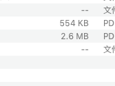

---

---

# 方法区

一般说堆的时候，就直接的包含年轻代与老年代，不包含永久代或方法区

元空间与永久代的区别：元空间使用本地内存，永久代使用JVM中的内存

内存泄露：没用的对象不能被GC

常量池与运行时常量池

非静态的方法在局部变量表中，0索引的位置存放的是 this

操作数栈，本地变量表（相当于一个数组，保存着的变量名称，名称对应着一个索引，可以保存对应变量的值）（局部变量表中也可以保存变量的值，并不是只有一个引用信息，直接的指向操作数栈？？？）

技术的提升，多问为什么

技术的深度，对问题的理解，评估学习能力，（多问为什么，不会的就去百度）

StringTable(字符串常量池)为什么变化：放在堆中，（静态变量也放在了堆中）

- 永久代的回收的效率是比较低的，在full GC的时候才会触发，full GC是在老年代空间不足，或者永久代空间不足的时候才会被触发，倒找了StringTable的回收效率不高，
- 但是，在开发中有大量的字符串被创建。回收的效率很低，永久代的空间不足，放在堆中，有利于及时的回收内存（永久代本来就是在堆中的，但是需要进行FUll GC）

**_*引用名的变化*_**

方法区(Person)

对象放在哪里？(堆)

对象本身放在哪(栈)

java中垃圾收集的主要的内容：常量池中废弃的常量和不在使用的类型

在方法区中的类会记录由什么类加载器进行加载的，类加载器也会记录加载了什么方法，便于方法区中的垃圾回收

