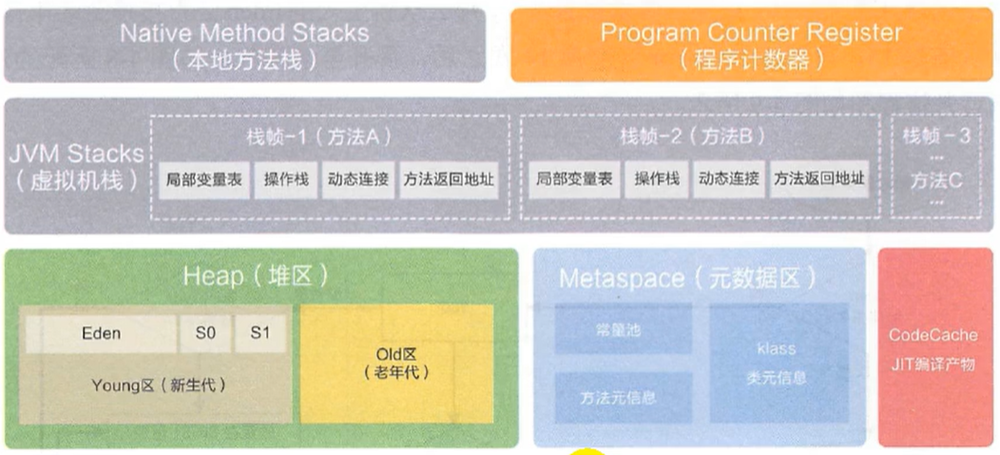

# 概述

在运行时的数据区中：
- 有些会随着虚拟机的启动而启动，有些随着虚拟机的退出而销毁
- 有些和线程的生命周期相同，随着线程的创建而创建，随着线程的销毁而销毁
 

在JVM中：
- **线程独有的：**程序计数器（PC寄存器）、虚拟机栈、本地方法栈
- **线程间共享的：**堆区、方法区（元数据区）

## 线程
- 线程是一个程序里的运行单元。JVM允许一个应用有多个线程并行的执行
- 在Hotspot JVM里，每个线程都与**操作系统的本地线程直接映射**
- 当一个Java线程准备好执行以后，此时一个操作系统的本地线程也同时创建。Java线程执行终止后，本地线程也会回收
- 操作系统负责将线程安排调度到任何一个可用的CPU上。一旦本地线程初始化成功，它就会调用Java线程中的run()方法
- 如果一个线程抛异常，并且该线程时进程中最后一个守护线程，那么进程将停止

这些主要的后台系统线程在Hotspot JVM里主要是以下几个：
1. 虚拟机线程：这种线程的操作是需要JVM达到安全点才会出现。这些操作必须在不同的线程中发生的原因是他们都需要JVM达到安全点，这样堆才不会变化。这种线程的执行类型括"stop-the-world"的垃圾收集，线程栈收集，线程挂起以及偏向锁撤销
2. 周期任务线程：这种线程是时间周期事件的体现（比如中断），他们一般用于周期性操作的调度执行
3. GC线程：这种线程对在JVM里不同种类的垃圾收集行为提供了支持
4. 编译线程：这种线程在运行时会将字节码编译成到本地代码
5. 信号调度线程：这种线程接收信号并发送给JVM，在它内部通过调用适当的方法进行处理

