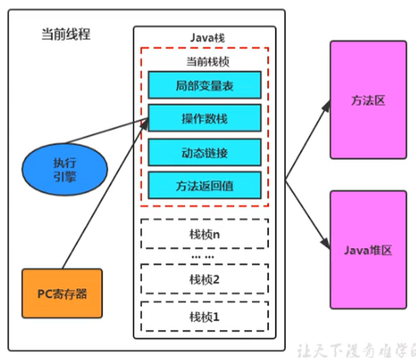

# 程序计数器（PC寄存器）
- **是运行速度最快的储存区域**
- 是JVM中，**唯一一个没有内存溢出错误的区域 `OutofMemoryError`**，没有error的情况
- 储存指令相关的信息（储存JVM指令地址，使用java编写的代码）
    - 在执行`native`方法时，是未指定值`undefined`
- JVM规范中，每一个线程都有自己独立的PC寄存器，是线程私有的

## 作用
用于储存下一个指定的地址，然后交给执行引擎进行处理，在JVM中多个线程是并发执行的（不是并行），在多个线程之间切换，PC寄存器就是记住当前线程的执行的进度。

## 面试题
**使用PC寄存器存储字节码指令地址有什么用呢？**
或者问
**为什么使用 PC 寄存器来记录当前线程的执行地址呢？**

1. 因为线程是一个个的顺序执行流，CPU需要不停的切换各个线程，这时候切换回来以后，就得知道接着从哪开始继续执行
2. JVM的字节码解释器就需要通过改变PC寄存器的值来明确下一条应该执行什么样的字节码指令
3. 为了能够准确地记录各个线程正在执行的当前字节码指令地址，最好的办法自然是为每一个线程都分配一个PC寄存器
