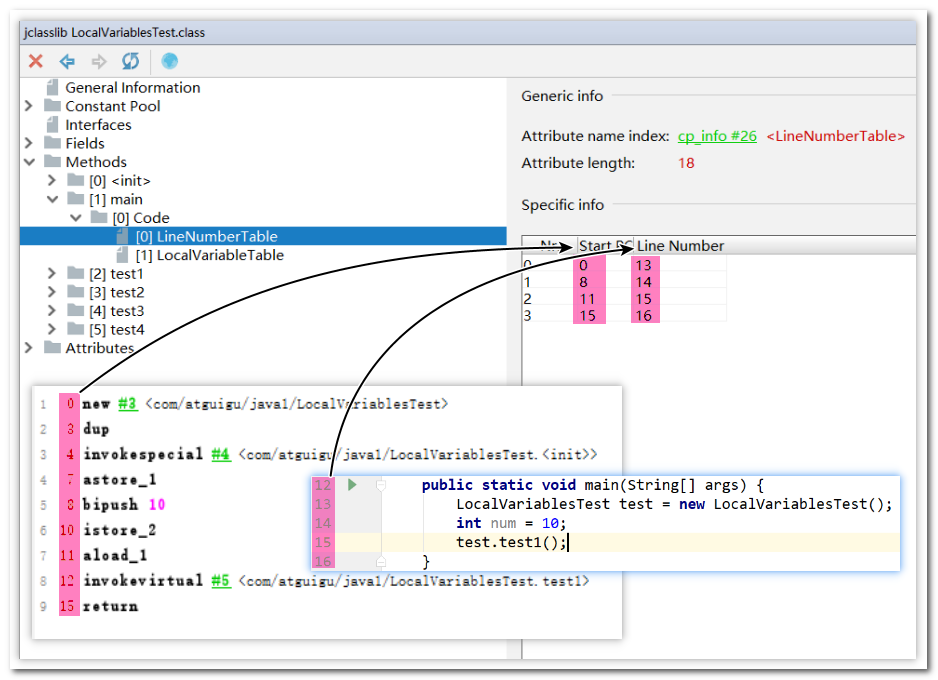
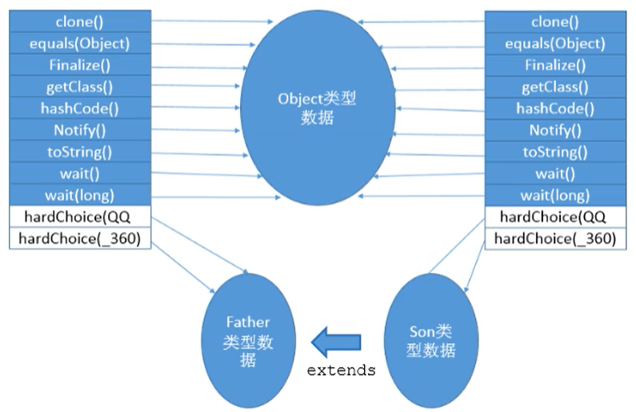

# 虚拟机栈

# 背景
- 由于JVM是跨平台的，不同CPU架构的不同，不能设计成基于寄存器的，java指令都是**基于栈**进行设计的
- 基于栈的设计优点是跨平台，指令集小，但是缺点也很明显，会导致性能下降，**实现相同的功能需要更多的指令来完成**

# 内存的中堆与栈
**栈是运行时的单位，堆是数据储存时的单位**
- 栈解决的是程序运行时的问题，即程序如何的运行，以什么的顺序运行，怎么去处理数据
- 堆解决的是数据储存的问题，即数据保存在哪

# 虚拟机栈的介绍
虚拟机栈是不共享的，是线程独立的

随着线程的创建而创建，生命周期与线程保持一致。内部保存的基本的单位是**栈帧**，每一个栈帧对应这一个方法的调用，虚拟机栈中储存的就是线程中方法的调用。

栈的常用的操作只有两个：入栈与出栈
- 操作完成后就会进行出栈

虚拟机栈中不会有GC（垃圾回收），但是会出现`StackOverflowError`

## 虚拟机会出现的异常（Error）
面试题：栈中可能出现的异常

* Java 虚拟机规范允许Java栈的大小是动态的或者是固定不变的。
* 如果采用固定大小的Java虚拟机栈，那每一个线程的Java虚拟机栈容量可以在线程创建的时候独立选定。
* 如果线程请求分配的栈容量超过Java虚拟机栈允许的最大容量，Java虚拟机将会抛出一个`StackoverflowError` 异常。
* 如果Java虚拟机栈可以动态扩展，并且在尝试扩展的时候无法申请到足够的内存，或者在创建新的线程时没有足够的内存去创建对应的虚拟机栈，那Java虚拟机将会抛出一个 `OutofMemoryError` 异常。

**超出虚拟机栈运行的最大的容量，就会出发栈溢出异常，虚拟机栈在尝试进行扩展的时候或则尝试创建新的线程，却没有足够的内存的时候，就会触发OOM，内存溢出异常**

在运行的时候，可以指定`栈内存`的大小，`-Xss256m`

## 栈运行
- 在一条活动线程中，一个时间点上，只会有一个活动的栈帧。即只有当前正在执行的方法的栈帧（栈顶栈帧）是有效的
    - 这个栈帧被称为当前栈帧（Current Frame）
    - 与当前栈帧相对应的方法就是当前方法（Current Method）
    - 定义这个方法的类就是当前类（Current Class）
- 执行引擎运行的所有字节码指令只针对当前栈帧进行操作。
- 当前方法调用了其他方法，方法返回时，当前栈帧会传回此方法的执行结果给前一个栈帧，虚拟机会丢弃当前栈帧，使得前一个栈帧重新成为当前栈帧。
- java方法返回的两种方法：
    - 正常执行
    - 抛出异常


# 栈帧的结构
包括:
- 局部变量表（在构造函数与实例方法中，第一个变量是this）
- 操作数栈
- 动态链接
- 方法返回地址
- 一些附加信息

栈帧的大小主要由**局部变量表** 和 **操作数栈**决定的

## 局部变量表
- 数字数组，用户储存方法的参数和定义在方法内的局部变量
- 局部变量的大小是在**编译器**就确定的，在运行区间是不会改变局部变量表的大小的，保存在方法的Code属性的`maximum local variables`




### Slot
* 参数值的存放总是从局部变量数组**索引 0** 的位置开始，到数组长度-1的索引结束。
* 局部变量表，最基本的存储单元是Slot（变量槽），局部变量表中存放编译期可知的各种基本数据类型（8种），引用类型（reference），returnAddress类型的变量。
* 在局部变量表里，32位以内的类型只占用一个slot（包括returnAddress类型），**64位的类型占用两个slot（long和double）**
* JVM会为局部变量表中的每一个Slot都分配一个访问索引，通过这个索引即可成功访问到局部变量表中指定的局部变量值
* 当一个实例方法被调用的时候，它的方法参数和方法体内部定义的局部变量将会按照顺序被复制到局部变量表中的每一个slot上
* 如果需要访问局部变量表中一个64bit的局部变量值时，只需要使用前一个索引即可。（比如：访问long或doub1e类型变量）
* 如果当前帧是由==构造方法或者实例方法==创建的，那么该对象**引用this将会存放在index为0的slot处**，其余的参数按照参数表顺序继续排列。


`static`不能直接调用一般的属性
- `static`不能直接的调用`this`
- `this`不存在与`static`方法的局部变量表中

### Slot -- 重复利用
栈帧中的局部变量表中的槽位是可以重用的，**如果一个局部变量过了其作用域，那么在其作用域之后申明新的局部变量变就很有可能会复用过期局部变量的槽位**，从而达到节省资源的目的。


```java
public void test4() {
    int a = 0;
    {
        int b = 0;
        b = a + 1;
    }
    //变量c使用之前已经销毁的变量b占据的slot的位置
    int c = a + 1;
}
```


### 变量的分类
按照数据类型分：
- 基本数据类型
- 引用数据类型

按照在类中声明的方式分：
- 成员变量：在使用前，都经历过默认初始化赋值
    - 类变量(使用static声明的变量，可以直接的使用**类.名称**调用)：
        - linking的prepare阶段：给类变量默认赋值  ---> initial阶段：给类变量显式赋值即静态代码块赋值
    - 实例变量：随着对象的创建，会在堆空间中分配实例变量空间，并进行默认赋值
- 局部变量：在使用前，必须要进行显式赋值的！否则，编译不通过
    - 应该是栈中数据弹出后，不会清除上次的值，再次使用时，如果不显示初始化，就会出现脏数据

**局部变量需要进行显示的赋值，成员变量会在初始化的过程中进行默认赋值**

    虚拟机使用局部变量表完成方法的传递
    
    局部变量表中的变量是**重要的垃圾回收的根节点**，只要被局部变量表中直接或者间接引用的对象都不会被回收

## 操作数栈
操作数栈在底层使用数组编写：==保存计算的中间结果，同时作为计算过程中变量的临时的存储空间。==


- 操作数栈就是JVM执行引擎的一个工作区，**当一个方法刚开始执行的时候，一个新的栈帧也会随之被创建出来**，这时方法的操作数栈是空的（这个时候数组是有长度的，只是操作数栈为空）
- 每一个操作数栈都会拥有一个明确的栈深度用于存储数值，其所需的**最大深度在编译期**就定义好了，保存在方法的Code属性中，为`maxstack`的值。
- 32bit的类型占用一个栈单位深度
- 64bit的类型占用两个栈单位深度
- 操作数栈并非采用访问索引的方式来进行数据访问的，而是只能通过标准的入栈和出栈操作来完成一次数据访问
- 如果被调用的方法带有返回值的话，其**返回值将会被压入当前栈帧的操作数栈中**，**并更新PC寄存器中下一条需要执行的字节码指令**。

Java虚拟机的解释引擎是基于栈的执行引擎，其中的栈指的就是操作数栈。

==常见的i++和++i 的区别==

```java
public class OperandStackTest {
    public void testAddOperation() {
        //byte、short、char、boolean：都以int型来保存
        byte i = 15;
        int j = 8;
        int k = i + j;

       // int m = 800;

    }

    public int getSum(){
        int m = 10;
        int n = 20;
        int k = m + n;
        return k;
    }

    public void testGetSum(){
        //获取上一个栈桢返回的结果，并保存在操作数栈中
        int i = getSum();
        int j = 10;
    }

    /*
    程序员面试过程中， 常见的i++和++i 的区别，放到字节码篇章时再介绍。

     */

    public void add(){
        //第1类问题：
        int i1 = 10;
        i1++;  // 11
        System.out.println(i1);

        int i2 = 10;
        ++i2; // 11
        System.out.println(i2);

        //第2类问题：
        int i3 = 10;
        int i4 = i3++;  // 10
        System.out.println(i3 + "，，，");
        System.out.println(i4);

        int i5 = 10;
        int i6 = ++i5;  // 11
        System.out.println(i6);

        //第3类问题：
        int i7 = 10;
        i7 = i7++; // 11 error
        System.out.println(i7); // 10

        int i8 = 10;
        i8 = ++i8; // 11
        System.out.println(i8);

        //第4类问题：
        int i9 = 10;
        int i10 = i9++ + ++i9; // 22
        System.out.println(i10);
    }

    public static void main(String[] args) {
        new OperandStackTest().add();
    }
}
```

```java.class
0 bipush 10
2 istore_1
3 iinc 1 by 1
6 getstatic #3 <java/lang/System.out>
9 iload_1
10 invokevirtual #4 <java/io/PrintStream.println>
13 bipush 10
15 istore_2
16 iinc 2 by 1
19 getstatic #3 <java/lang/System.out>
22 iload_2
23 invokevirtual #4 <java/io/PrintStream.println>
26 bipush 10
28 istore_3
29 iload_3
30 iinc 3 by 1
33 istore 4
35 getstatic #3 <java/lang/System.out>
38 new #5 <java/lang/StringBuilder>
41 dup
42 invokespecial #6 <java/lang/StringBuilder.<init>>
45 iload_3
46 invokevirtual #7 <java/lang/StringBuilder.append>
49 ldc #8 <，，，>
51 invokevirtual #9 <java/lang/StringBuilder.append>
54 invokevirtual #10 <java/lang/StringBuilder.toString>
57 invokevirtual #11 <java/io/PrintStream.println>
60 getstatic #3 <java/lang/System.out>
63 iload 4
65 invokevirtual #4 <java/io/PrintStream.println>
68 bipush 10
70 istore 5
72 iinc 5 by 1
75 iload 5
77 istore 6
79 getstatic #3 <java/lang/System.out>
82 iload 6
84 invokevirtual #4 <java/io/PrintStream.println>
87 bipush 10
89 istore 7
91 iload 7
93 iinc 7 by 1
96 istore 7
98 getstatic #3 <java/lang/System.out>
101 iload 7
103 invokevirtual #4 <java/io/PrintStream.println>
106 bipush 10
108 istore 8
110 iinc 8 by 1
113 iload 8
115 istore 8
117 getstatic #3 <java/lang/System.out>
120 iload 8
122 invokevirtual #4 <java/io/PrintStream.println>
125 bipush 10
127 istore 9
129 iload 9
131 iinc 9 by 1
134 iinc 9 by 1
137 iload 9
139 iadd
140 istore 10
142 getstatic #3 <java/lang/System.out>
145 iload 10
147 invokevirtual #4 <java/io/PrintStream.println>
150 return
```

**在进行赋值的时候是load出来的值**
i++ 先load 在add 
++i 先add 在load 

### 栈顶缓存
* 基于栈式架构的虚拟机所使用的零地址指令更加紧凑，但完成一项操作的时候必然需要使用更多的入栈和出栈指令，这同时也就意味着将需要更多的指令分派（instruction dispatch）次数和内存读/写次数。
* 由于操作数是存储在内存中的，因此频繁地执行内存读/写操作必然会影响执行速度。为了解决这个问题，HotSpot JVM的设计者们提出了栈顶缓存（Tos，Top-of-Stack Cashing）技术，将栈顶元素全部缓存在物理CPU的寄存器中，以此降低对内存的读/写次数，提升执行引擎的执行效率。
* 寄存器的主要优点：指令更少，执行速度快

## 动态链接
- 指向运行时常量池中该栈帧所属的方法引用
- 包含这个引用的目的就是为了支持当前方法的代码能够实现动态链接（Dynamic Linking），比如：`invokedynamic`指令
- 在Java源文件被编译到字节码文件中时，所有的变量和方法引用都作为符号引用（Symbolic Reference）保存在class文件的常量池里
- 动态链接的作用就是为了将这些**符号引用**（#2）转换为调用方法的**直接引用**

### 使用运行时常量池的目的
- 不同的方法，都可能去调用常量或者方法，只需要储存一份，然后记录其应用就可以，节省了资源
- 常量池的作用：提供一些符号和常量，便于指令的识别

### 解析与分派
#### 静态链接与动态链接
两种将符号应用转化成直接引用的方式
- 静态链接（在编译期间确定）
    - 如果被调用的目标方法**在编译期确定**，且运行期保持不变时，这种情况下将调用方法的符号引用转换为直接引用的过程称之为静态链接
- 动态链接
    - 如果被调用的方法在编译期无法被确定下来，也就是说，只能够在程序运行期将调用的方法的符号转换为直接引用，由于这种引用转换过程具备动态性

#### 早期绑定与晚期绑定（符号引用转化成直接引用的过程）
静态链接和动态链接对应的方法的绑定机制为：早期绑定（Early Binding）和晚期绑定（Late Binding）。
绑定是一个字段、方法或者类在符号引用被替换为直接引用的过程，这仅仅发生一次。


#### 多态性与方法绑定
编程语言具备**多态特性**，那么也就具备早期绑定和晚期绑定两种绑定方式。

Java中任何一个普通的方法其实都具备虚函数的特征，它们相当于C++语言中的虚函数（C++中则需要使用关键字virtual来显式定义）。如果在Java程序中不希望某个方法拥有虚函数的特征时，则可以使用关键字final来标记这个方法。

##### 虚方法与非虚方法
- 如果方法在**编译期**就确定了具体的调用版本，这个版本在运行时是不可变的。这样的方法称为非虚方法。
- 静态方法、私有方法、final方法、实例构造器、父类方法都是**非虚方法**。
- 其他方法称为**虚方法**。


子类对象的多态的使用前提：
- 类的继承关系
- 方法的重写

四条普通指令：
- `invokestatic`：调用静态方法，解析阶段确定唯一方法版本
- `invokespecial`：调用<init>方法、私有及父类方法，解析阶段确定唯一方法版本
- `invokevirtual`：调用所有虚方法
- `invokeinterface`：调用接口方法
- 一条动态调用指令
    - `invokedynamic`：动态解析出需要调用的方法，然后执行


1. 前四条指令固化在虚拟机内部，方法的调用执行不可人为干预
2. 而`invokedynamic`指令则支持由用户确定方法版本
3. 其中`invokestatic`指令和`invokespecial`指令调用的方法称为非虚方法，其余的（final修饰的除外）称为虚方法。

###### `invokedynamic`

- JVM字节码指令集一直比较稳定，一直到Java7中才增加了一个invokedynamic指令，这是Java为了实现【动态类型语言】支持而做的一种改进。
- 但是在Java7中并没有提供直接生成invokedynamic指令的方法，需要借助ASM这种底层字节码工具来产生invokedynamic指令。直到Java8的Lambda表达式的出现，invokedynamic指令的生成，在Java中才有了直接的生成方式。
- Java7中增加的动态语言类型支持的本质是对Java虚拟机规范的修改，而不是对Java语言规则的修改，这一块相对来讲比较复杂，增加了虚拟机中的方法调用，最直接的受益者就是运行在Java平台的动态语言的编译器。


lamda

    类型的检查是在编译期还是在运行期，满足前者就是静态类型语言，反之是动态类型语言。
    
    静态类型的语言在编译期间就可以判断变量的类型
    动态类型变量是没有类型信息的，变量的值才会有类型信息

```python
# 不需要声明类型，根据变量的值去判断变量的类型
info = 16.7
```

##### 回看解析阶段（类加载器）

**解析阶段就是将常量池内的符号引用转换为直接引用的过程**
解析动作主要针对类或接口、字段、类方法、接口方法、方法类型等。对应常量池中的CONSTANT Class info、CONSTANT Fieldref info、CONSTANT Methodref info等

#### 方法重写的本质
maven 中jar包冲突，会导致AcessIllerror

#### 多态与虚方法表
虚方法表
1. 在面向对象的编程中，会很频繁的使用到动态分派，如果在每次动态分派的过程中都要重新在类的方法元数据中搜索合适的目标的话就可能影响到执行效率。
2. 因此，为了提高性能，JVM采用在类的方法区建立一个虚方法表（virtual method table）来实现，非虚方法不会出现在表中。使用索引表来代替查找。
3. 每个类中都有一个虚方法表，表中存放着各个方法的实际入口。
4. 虚方法表是什么时候被创建的呢？虚方法表会在类加载的链接阶段被创建并开始初始化，类的变量初始值准备完成之后，JVM会把该类的虚方法表也初始化完毕。
5. 如图所示：如果类中重写了方法，那么调用的时候，就会直接在该类的虚方法表中查找


### 方法返回地址
* 存放调用该方法的pc寄存器的值。一个方法的结束，有两种方式：
    * 正常执行完成
    * 出现未处理的异常，非正常退出
* 无论通过哪种方式退出，在方法退出后都返回到该方法被调用的位置。方法正常退出时，调用者的pc计数器的值作为返回地址，即调用该方法的指令的下一条指令的地址。而通过异常退出的，返回地址是要通过异常表来确定，栈帧中一般不会保存这部分信息。
* 本质上，方法的退出就是当前栈帧出栈的过程。此时，需要恢复上层方法的局部变量表、操作数栈、将返回值压入调用者栈帧的操作数栈、设置PC寄存器值等，让调用者方法继续执行下去。
* 正常完成出口和异常完成出口的区别在于：通过异常完成出口退出的不会给他的上层调用者产生任何的返回值。

# 相关题
    举例栈溢出的情况？（StackOverflowError）
    - 通过 -Xss 设置栈的大小
    
    调整栈大小，就能保证不出现溢出么？
    - 不能
    
    分配的栈内存越大越好么？
    - 不是，一定时间内降低了OOM概率，但是会挤占其它的线程空间，因为整个虚拟机的内存空间是有限的
    
    垃圾回收是否涉及到虚拟机栈？
    - 虚拟机栈中是不存在GC的，存在Error，在堆中和方法区中使用
    
    方法中定义的局部变量是否线程安全？
    - 在内部产生，内部消亡，方法中的局部变量就是线程安全的


